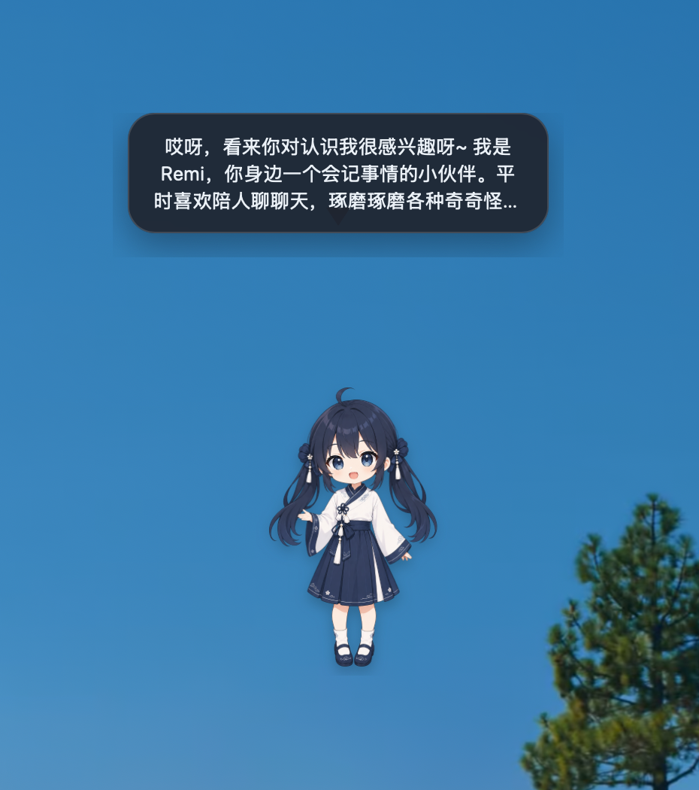
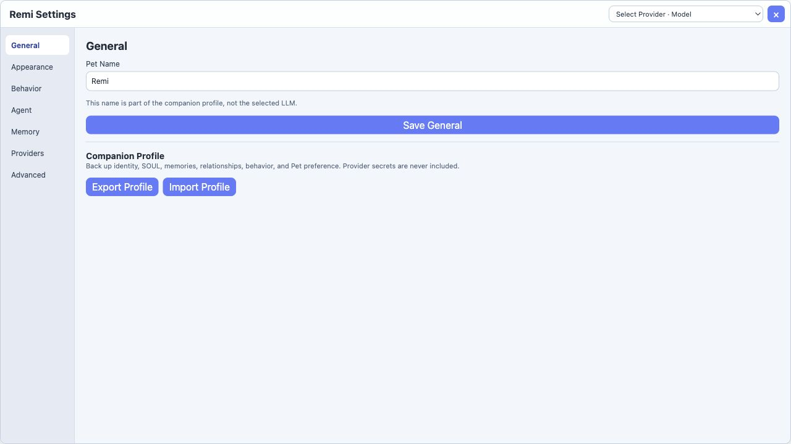

# Remi — Persistent Personal LLM Agent

[English](README.md) | [简体中文](README.zh-CN.md)

Remi is a macOS-first persistent personal LLM agent embodied as a desktop companion. It is built with Tauri 2, React, TypeScript, Rust, and SQLite.

## Screenshots

| Desktop companion                                                                        | Settings interface                                                       |
| ---------------------------------------------------------------------------------------- | ------------------------------------------------------------------------ |
|  |  |

## Current capabilities

- A transparent, always-on-top macOS desktop character with local movement and switchable Pet Packs.
- A unified Agent Runtime for user chat and autonomous heartbeat decisions.
- Reply and proactive speech bubbles that follow the character, avoid covering it, remain inside the current display, and stay visible according to message length.
- Configurable OpenAI-compatible providers, endpoints, and models.
- Persistent identity and state through an editable `SOUL.md`, Pet State, and context builder.
- Working, Semantic, Episodic, and Relationship Memory that survives restarts.
- Controls for inspecting, correcting, pinning, archiving, restoring, and deleting memories.
- Proactive behavior governed by local preferences, quiet hours, cooldowns, and hourly limits.
- Companion Profile export and import without Provider credentials or API keys.
- Trace recording for events, actions, memory operations, and LLM activity.

## Configure an LLM provider

### In the application

1. Start Remi and right-click the desktop character.
2. Open **Settings → Providers**.
3. Add an OpenAI-compatible base URL, API key, and one or more model IDs.
4. Enable the Provider and choose **Set Active** for the model you want to use.

API keys are stored in the current macOS user's Keychain, so they survive application restarts. They are never written to SQLite and are excluded from Companion Profile exports.

### With environment variables

Use `.env.example` as a reference and export these values in the shell that starts Tauri:

```bash
export REMI_LLM_BASE_URL="https://api.openai.com/v1"
export REMI_LLM_MODEL="your-model-id"
export REMI_LLM_API_KEY="your-api-key"
npm run tauri -- dev
```

The endpoint must expose an OpenAI-compatible `/chat/completions` API.

## Run locally

Requirements:

- macOS
- Node.js 20 or newer
- Rust stable
- Apple Command Line Tools (`xcode-select --install`)

```bash
git clone https://github.com/Yetchill/remi-persistent-agent.git
cd remi-persistent-agent
npm install
npm run tauri -- dev
```

## Build and deploy on macOS

Run the checks and create the application bundle:

```bash
npm install
npm run typecheck
npm test
npm run tauri -- build
```

The bundle is generated at:

```text
src-tauri/target/release/bundle/macos/Remi.app
```

For a local installation, copy `Remi.app` into `/Applications`.

For distribution outside the Mac App Store, install a **Developer ID Application** certificate in Keychain, then find and export its signing identity:

```bash
security find-identity -v -p codesigning
export APPLE_SIGNING_IDENTITY="Developer ID Application: Your Name (TEAM_ID)"
```

Notarization can use an App Store Connect API key:

```bash
export APPLE_API_ISSUER="your-issuer-id"
export APPLE_API_KEY="your-key-id"
export APPLE_API_KEY_PATH="/absolute/path/to/AuthKey_KEYID.p8"
npm run tauri -- build
```

Alternatively, Tauri supports `APPLE_ID`, an app-specific `APPLE_PASSWORD`, and `APPLE_TEAM_ID`. Never commit certificates, private keys, signing passwords, API keys, or `.env.local`. See the official [Tauri macOS signing and notarization guide](https://v2.tauri.app/distribute/sign/macos/).

Application data is stored in the macOS app-data directory for `dev.remi.personal-agent`. It includes `SOUL.md`, SQLite memory and traces, Pet State, imported Pet Packs, and local profile backups.

## Future directions

- Study revision, supersession, consolidation, and forgetting in long-term memory.
- Improve heartbeat policies and adaptation to individual preferences.
- Add richer character appearances, animation systems, and cross-platform support.
- Explore voice interaction, external tools, and stronger privacy controls.
- Complete a signed and notarized macOS release workflow.
